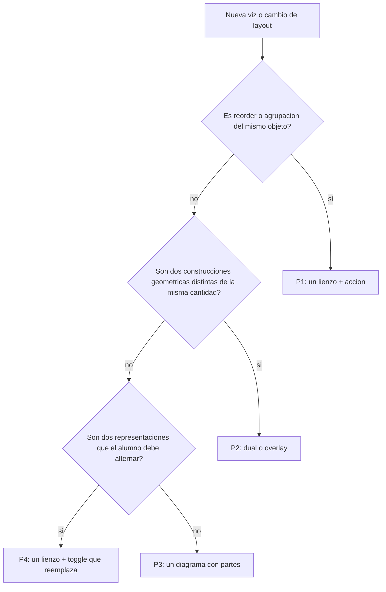

# Plan de interacción pedagógica — viz de Álgebra

Documento de criterios para diseñar e implementar recursos gráficos. Objetivo: que cada viz **enseñe** el concepto sin convertirse en ruido (p. ej. duales “2 en 1” aplicados por costumbre).

Fuente de verdad del runtime: modos en `apps/web-public/lib/viz-modes.ts`, componentes en `apps/web-public/components/algebra/viz/`, copy en `content/formulas-algebra.md`.

---

## 1. Principios (cerrados)

### P1 — Acción / reorder

**Qué enseña:** el mismo objeto cambia de orden o de agrupación; el resultado no cambia.

**Layout:** un solo lienzo. El estudiante provoca el cambio.

**Interacción:** botón o control explícito (Intercambiar, Agrupar izquierda/derecha). No arrastrar obligatorio si el botón basta.

**No hacer:** dos filas estáticas “antes / después” a la vez. Eso elimina el “aha” de la acción.

**Aplica a:** `commute`, `associate`.

### P2 — Reescritura / dos formas geométricas

**Qué enseña:** dos construcciones distintas representan la misma cantidad (área, valor).

**Layout:** dual panel o overlay justificado (LHS ↔ RHS con formas diferentes).

**Interacción:** sliders actualizan ambas formas; caption confirma igualdad.

**Aplica a:** `distribute`, `square_minus` (forma limpia vs expansión), De Morgan en `logic_gate`.

### P3 — Descomposición en sitio

**Qué enseña:** un todo se parte en piezas etiquetadas.

**Layout:** un diagrama con regiones (p. ej. \((a+b)^2\), rejilla \((a+b)(c+d)\)).

**No hacer:** duplicar el mismo diagrama “expandido” al lado si las piezas ya están en el original.

**Aplica a:** `square`, `poly_grid`, `binomial` (fila de Pascal / coeficientes).

### P4 — Toggle de forma

**Qué enseña:** la misma identidad en dos representaciones; el estudiante **cambia** de una a otra.

**Layout:** un lienzo que **reemplaza** la escena al pulsar (no dual permanente).

**Aplica a:** `diff_sq` (expandido ↔ factorizado), `complete_square` (añadir/quitar el cuadrado del hueco).

### Regla de oro

Si quitar el segundo panel **no pierde** el concepto y un botón/acción lo demuestra **mejor**, **no uses dual**.

---

## 2. Fichas por modo `algebra_tiles`

### `commute` (ALG-FND-001)

| Campo | Decisión |
|---|---|
| **Enseña** | El orden de sumandos no cambia el total. |
| **Layout** | Una fila: bloques \(a\), \(b\) + barra de longitud \(a+b\). Etiqueta refleja el orden actual. |
| **Interacción** | Sliders \(a\), \(b\); botón **Intercambiar** (`swapped`). |
| **Técnico** | Estado `swapped: boolean`. Caption: orden actual = total. Labels: `swap`, `orderAb`. |
| **Veredicto** | **RESTORE** — single + botón (no dual-row). |

### `associate` (ALG-FND-002)

| Campo | Decisión |
|---|---|
| **Enseña** | Cambiar la agrupación no cambia el total. |
| **Layout** | Un trío de bloques \(a,b,c\); un recuadro discontinuo que marca \((a+b)\) o \((b+c)\). |
| **Interacción** | Sliders \(a,b,c\); botón **Agrupar izquierda / derecha** (`assocRight`). |
| **Técnico** | Estado `assocRight: boolean`. Caption muestra la expresión activa. Labels: `groupLeft`, `groupRight`. |
| **Veredicto** | **RESTORE** — single + toggle (no dual-row). |

### `distribute` (ALG-FND-003, ALG-FAC-001)

| Campo | Decisión |
|---|---|
| **Enseña** | \(a(b+c)\) y \(ab+ac\) son la misma área (expandir / factor común). |
| **Layout** | Dual panel: rectángulo único vs dos rectángulos separados. FAC-001 invierte lados (flecha ←). |
| **Interacción** | Sliders \(a,b,c\); ambas áreas se actualizan; caption confirma igualdad. |
| **Técnico** | `fitScale`; `formulaId.includes('FAC-001')` para invertir paneles. |
| **Veredicto** | **KEEP** dual — es reescritura (P2). |

### `square` (IDN-001, FAC-003)

| Campo | Decisión |
|---|---|
| **Enseña** | \((a+b)^2 = a^2+2ab+b^2\) como partición de un cuadrado. |
| **Layout** | Un cuadrado compuesto (4 regiones etiquetadas). |
| **Veredicto** | **KEEP** descomposición en sitio (P3). |

### `square_minus` (IDN-002)

| Campo | Decisión |
|---|---|
| **Enseña** | \((a-b)^2\) vs expansión \(a^2-2ab+b^2\). |
| **Layout** | Dual: cuadrado limpio de lado \(a-b\) ↔ cuadrado \(a\) con piezas \(\pm ab\), \(+b^2\). |
| **Veredicto** | **KEEP** dual — reescritura geométrica (P2). |

### `diff_sq` (IDN-003, FAC-002)

| Campo | Decisión |
|---|---|
| **Enseña** | \(a^2-b^2 = (a-b)(a+b)\). |
| **Layout** | Toggle que **reemplaza**: L-región (\(a^2\) con hueco \(b^2\)) **o** rectángulo \((a-b)\times(a+b)\). No dual permanente al factorizar. |
| **Interacción** | Botón expandido ↔ factorizado. |
| **Veredicto** | **ADJUST** — restaurar reemplazo de escena (P4). |

### `poly_grid` (EXP-003)

| Campo | Decisión |
|---|---|
| **Enseña** | Producto de binomios como rejilla de áreas. |
| **Layout** | Una rejilla \(2\times2\). |
| **Veredicto** | **KEEP** (P3). |

### `binomial` (IDN-008)

| Campo | Decisión |
|---|---|
| **Enseña** | Coeficientes de \((a+b)^n\) (fila de Pascal). |
| **Layout** | Una fila / diagrama de coeficientes. |
| **Veredicto** | **KEEP**. |

### `complete_square` (EQU-005)

| Campo | Decisión |
|---|---|
| **Enseña** | Completar el cuadrado añadiendo/restando \((b/2)^2\). |
| **Layout** | Un diagrama; toggle muestra/oculta el hueco. |
| **Veredicto** | **KEEP** (P4). |

### `degree` (POL-008)

| Campo | Decisión |
|---|---|
| **Enseña** | Grado como suma de exponentes en monomio. |
| **Layout** | Representación simple de exponentes (no dual de identidades). |
| **Veredicto** | **KEEP**. |

### `power` (POT-* excepto POT-008)

| Campo | Decisión |
|---|---|
| **Enseña** | \(a^n\cdot a^m = a^{n+m}\) (apilar / unir exponentes). |
| **Layout** | Filas de “bloques de potencia” que ilustran la suma de exponentes; no es dual LHS/RHS de una identidad de reorder. |
| **Veredicto** | **KEEP** (no confundir con P1). |

### `conjugate_rationalize` (POT-008)

| Campo | Decisión |
|---|---|
| **Enseña** | \((a+\sqrt{b})(a-\sqrt{b}) = a^2-b\) (producto racional). |
| **Layout** | Factores + bloque de producto; comparación de forma, no reorder. |
| **Veredicto** | **KEEP** con cuidado de no saturar; prioridad baja de churn. |

---

## 3. Criterios breves por tipo de viz

| Tipo | Criterio | Duales actuales |
|---|---|---|
| `graph` | Overlay en **mismos** ejes (curvas, raíces, intersección). No dos paneles de la misma función. | `system`, `poly_system`, `inverse_pair` OK como overlay. |
| `matrix` | Panel resultado solo si aporta info nueva (A vs Aᵀ, L·U). No clonar A “por si acaso”. | `transpose`, `lu`, ops: OK si RHS ≠ copia cosmélica. |
| `matrix_transform` | Pasos de descomposición secuenciales, no dual estático inútil. | SVD/QR: etapas, no 2-en-1 forzado. |
| `vector` | Un plano; proyecciones/ángulos en sitio. | No dual paneles. |
| `logic_gate` | Dual OK para De Morgan: LHS y RHS son expresiones lógicas distintas (P2). | **Pasa** el criterio. |
| `truth_table` | Columnas de comparación en tabla (no SVG dual). | OK. |
| `number_line` / `modular_clock` | Un eje / un reloj; badges de igualdad. | No dual. |
| `error_correction` | Estado del código + síndrome; no duplicar la misma trama. | — |

**Prohibido por defecto:** aplicar “dos paneles siempre que haya una igualdad \(A=B\)”. Solo si \(A\) y \(B\) son **construcciones visuales distintas** (P2) o el alumno debe **alternar** representaciones (P4).

---

## 4. Checklist de implementación (esta pasada)

1. [x] Este documento en `docs/algebra-viz-interaction-plan.md`.
2. [x] Restaurar `commute` y `associate` a single + botón en `AlgebraTilesViz.tsx`.
3. [x] Ajustar `diff_sq` factored a reemplazo de escena (no dual permanente).
4. [x] Mantener `distribute` y `square_minus` duales.
5. [x] Actualizar Idea / Elementos / Interactividad de FND-001 y FND-002 en `content/formulas-algebra.md`.
6. [x] Actualizar claves en `apps/web-public/content-i18n/{en,de,fr,it,pt}.json`.
7. [x] Seed de contenido algebra si el entorno tiene `DATABASE_URL` (prod/local habitual).

Fuera de alcance aquí: rehacer matrices/SVD/QR u otras familias; solo se fijan criterios para no repetir el error.

---

## 5. Criterio de aceptación

- **FND-001:** el estudiante pulsa Intercambiar y ve el mismo total en una sola fila.
- **FND-002:** alterna agrupación en el mismo trío de bloques.
- **FND-003:** sigue viendo dos construcciones de área.
- **IDN-003 / FAC-002:** al factorizar, la escena se reemplaza (no un segundo panel fijo permanente).
- Futuras viz consultan este documento antes de añadir duales.
