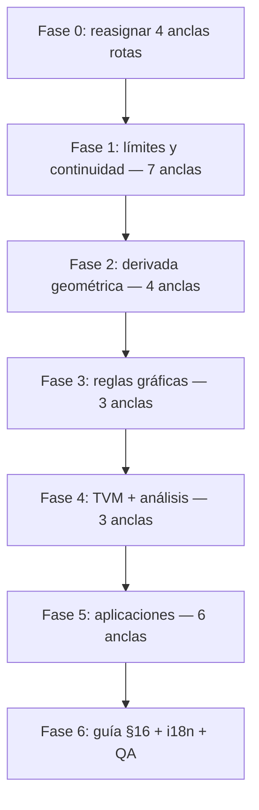

# Plan de corrección — Cálculo Diferencial

Plan de trabajo para cerrar los faltantes detectados en la auditoría (septiembre 2026). Integra **corrección de anclas**, **creación de recursos gráficos** (solo donde aportan valor pedagógico real) y **calidad de plataforma** (i18n, QA, contenido).

Complementa [`calculo-diferencial-viz-plan.md`](./calculo-diferencial-viz-plan.md) (descripciones pedagógicas por tipo) con criterios de selección, inventario honesto y fases de ejecución.

**Estado actual (Fase 6 cerrada):** 161 fórmulas, **27 anclas fórmula + §16 árbol de decisión**, QA automatizado **46 checks**, i18n contenido en paridad, LaTeX apéndice corregido.

**Objetivo:** curso **coherente y completo para lanzamiento** — no una viz por fórmula, sino una viz **apropiada, bien trabajada, entendible y verídica** en cada concepto que genuinamente se beneficia de lo gráfico (~**28 anclas**, ~**17 %** del catálogo, ~**100 %** de los temas visuales del núcleo).

---

## 1. Principio rector: inspección honesta, no cobertura total

### 1.1 Cuándo SÍ merece un recurso gráfico

Una fórmula entra al inventario viz si cumple **al menos dos** de estos criterios:

| # | Criterio | Ejemplo |
|---|----------|---------|
| C1 | El concepto es **geométrico o dinámico** (curvas, posición, límites, áreas) | Secante → tangente, TVM |
| C2 | Un gráfico **reduce ambigüedad** que el LaTeX solo no resuelve | ε-δ, discontinuidades |
| C3 | Hay **interacción natural** (slider, punto deslizable, escenario) que enseña el mecanismo | L'Hôpital, optimización |
| C4 | Es **ancla conceptual** de un bloque temático (una viz cubre varias fórmulas vecinas) | `concavity_analyzer` en §8 |

### 1.2 Cuándo NO merece viz

| Motivo | Secciones afectadas | Fórmulas (aprox.) |
|--------|---------------------|-------------------|
| Identidad algebraica o tabla de referencia | §1, §5.5–5.7, Apéndice A | DIF-001…010, 047–050, 056–072, **131–161** |
| Regla de cálculo sin interpretación gráfica propia | §2.4 álgebra de límites, §5.1 | DIF-015…019, 047–050 |
| Duplicado de otra fórmula ya anclada | §4, §7, §10 | DIF-039 (=038), 042 (=040), 083 (=082), 103 (=102) |
| Enunciado cualitativo sin construcción visual única | §6 notación, §9.1 procedimiento | DIF-075…080, texto §9.1 |
| Fórmula de reescritura / estrategia textual | §12.2, §14.1 | DIF-116…118, pasos §14.1 |

**Meta explícita:** **no** publicar viz en las 161 fórmulas. **Sí** cubrir el 100 % de los bloques donde un estudiante típico de Cálculo I esperaría “verlo en un gráfico”.

### 1.3 Estándares de calidad (obligatorios antes de publicar)

Tomar como referencia [`algebra-viz-interaction-plan.md`](./algebra-viz-interaction-plan.md):

1. **Verídico:** escalas, pendientes y valores numéricos coinciden con la fórmula (no ilustración decorativa).
2. **Entendible:** una sola idea por panel; copy embebido en el componente si hace falta (`vizHasEmbeddedGuide`).
3. **Bien trabajado:** controles con feedback inmediato; estados límite visibles (h→0, ε-δ, etc.).
4. **Ancla semántica:** el `detail` de la fórmula ancla describe exactamente lo que muestra el gráfico.
5. **Sin `comingSoonViz`** en ninguna ruta del inventario aprobado (§3).

---

## 2. Inventario aprobado tras inspección (161 fórmulas)

Leyenda: **Sí** = ancla o modo publicado · **Cubre** = misma viz, sin badge duplicado · **No** = sin viz (justificado).

### Resumen por sección

| § | Tema | Total | Con viz (anclas) | Sin viz | Cobertura conceptual |
|---|------|-------|------------------|---------|----------------------|
| 1 | Notación y dominios | 10 | 0 | 10 | — |
| 2 | Límites | 19 | 5 | 14 | ~90 % (conceptos clave) |
| 3 | Continuidad | 8 | 2 | 6 | ~85 % |
| 4 | Derivada geométrica | 9 | 4 | 5 | ~95 % |
| 5 | Reglas de derivación | 28 | 3 | 25 | reglas gráficas cubiertas |
| 6 | Orden superior | 6 | 0 | 6 | — |
| 7 | Valor medio | 6 | 2 | 4 | ~90 % |
| 8 | Análisis de funciones | 10 | 1 | 9 | 1 viz cubre todo el bloque |
| 9 | Optimización | 3 | 2 | 1 | ~95 % |
| 10 | Aprox. lineales | 6 | 1 | 5 | ~90 % |
| 11 | Taylor | 8 | 1 | 7 | polinomio + modos Maclaurin |
| 12 | L'Hôpital | 5 | 1 | 4 | regla principal |
| 13 | Implícitas | 4 | 1 | 3 | ejemplo canónico |
| 14 | Tasas relacionadas | 3 | 1 | 2 | escenario clásico |
| 15 | Asíntotas | 5 | 1 | 4 | explorador unificado |
| 16 | Guía | 0 fórmulas | 1 sección | — | árbol de decisión |
| A | Tabla derivadas | 31 | 0 | 31 | referencia; duplica §5 |
| | **Total** | **161** | **~28 anclas** | **~133** | **núcleo visual cubierto** |

---

### 2.1 Detalle: fórmulas CON viz (inventario maestro)

Una fila = una entrada en `CALCULO_DIFERENCIAL_VIZ_BY_FORMULA_ID` o sección.

| ID ancla | Tipo viz | Modo | Qué debe enseñar | Cubre también |
|----------|----------|------|------------------|---------------|
| **DIF-011** | `limit_explorer` | `informal` | \(x\to a\), \(f(x)\to L\) sin exigir \(f(a)=L\) | — |
| **DIF-012** | `limit_explorer` | `epsilon_delta` | Bandas ε y δ; definición formal | — |
| **DIF-013** | `limit_explorer` | `lateral` | \(L_L\), \(L_R\); existencia bilateral | DIF-014 |
| **DIF-020** | `limit_explorer` | `notable` | \(\operatorname{sen}x/x\to1\) al acercarse a 0 | — |
| **DIF-024** | `limit_explorer` | `e_definition` | \((1+x)^{1/x}\to e\) | DIF-025 (variante \(x\to\infty\)) |
| **DIF-030** | `continuity_checker` | `definition` | \(\lim f(x)=f(a)\) en un punto | — |
| **DIF-032** | `continuity_checker` | `discontinuity` | Removible, salto, infinita (selector) | DIF-033, DIF-034 |
| **DIF-031** | `intermediate_value` | — | Curva continua que cruza un valor \(k\) | DIF-037 |
| **DIF-038** | `limit_explorer` | `secante` | Cociente incremental; secante → tangente | DIF-039 |
| **DIF-040** | `tangent_line` | `tangent` | Recta tangente; pendiente \(f'(a)\) | DIF-042 |
| **DIF-041** | `tangent_line` | `normal` | Recta normal perpendicular a la tangente | — |
| **DIF-043** | `derivative_from_graph` | `kinematics` | \(s(t)\) y \(v(t)=s'(t)\) sincronizados | enlace CIN-004 |
| **DIF-044** | `derivative_from_graph` | `kinematics_accel` | Añade \(a(t)=s''(t)\) | enlace CIN-006 |
| **DIF-051** | `product_rule` | — | Curvas \(f\), \(g\), \(fg\); términos \(f'g+fg'\) | DIF-052 |
| **DIF-054** | `chain_rule` | — | Composición \(u=g(x)\), \(y=f(u)\); cadena de tasas | DIF-055 |
| **DIF-074** | `log_diff` | — | \(y=f^g\); pasos vía \(\ln y\) | DIF-073 |
| **DIF-081** | `mean_value_theorem` | `rolle` | Tangente horizontal en interior | — |
| **DIF-082** | `mean_value_theorem` | `mvt` | Secante paralela a tangente en \(c\) | DIF-083 |
| **DIF-089** | `concavity_analyzer` | — | \(f\), \(f'\), \(f''\); críticos e inflexión | DIF-087…096 |
| **DIF-098** | `optimization_scenario` | `rectangle` | Área máxima con perímetro fijo | — |
| **DIF-099** | `optimization_scenario` | `cylinder` | Volumen máximo con superficie fija | — |
| **DIF-102** | `linear_approximation` | — | \(f(x)\), \(L(x)\), error \(\Delta y\) | DIF-100…105 |
| **DIF-106** | `taylor_approximation` | — | Polinomio \(P_n\); sliders \(n\), \(a\) | DIF-108…112 (modos función) |
| **DIF-114** | `lhopital_explorer` | — | Cociente \(f/g\) vs \(f'/g'\) cerca del punto | DIF-115 |
| **DIF-121** | `implicit_curve` | `circle` | \(x^2+y^2=r^2\); tangente vía \(-x/y\) | DIF-119, DIF-120 |
| **DIF-124** | `related_rates` | `sphere` | Esfera inflándose; \(dV/dt\) y \(dr/dt\) | DIF-125 (modo escalera) |
| **DIF-128** | `asymptote_explorer` | — | Vertical, horizontal, oblicua en racional | DIF-126…129 |
| **§16** | `derivation_decision_tree` | — | Señal → técnica de derivación/análisis | guía + sección |

**Componentes nuevos a construir:** 12 tipos (algunos ya existen parcialmente).

| Tipo | Estado actual | Acción |
|------|---------------|--------|
| `limit_explorer` | Existe (`secante`); faltan modos | Extender con 4 modos |
| `tangent_line` | Existe | Añadir modo `normal` |
| `derivative_from_graph` | Existe (`kinematics`) | Añadir `kinematics_accel` |
| `taylor_approximation` | Reutiliza Cálculo II | Reasignar ancla a DIF-106 |
| `continuity_checker` | No existe | **Nuevo** |
| `intermediate_value` | No existe | **Nuevo** |
| `product_rule` | No existe | **Nuevo** |
| `chain_rule` | No existe | **Nuevo** |
| `log_diff` | No existe | **Nuevo** |
| `mean_value_theorem` | No existe | **Nuevo** |
| `concavity_analyzer` | No existe | **Nuevo** |
| `optimization_scenario` | No existe | **Nuevo** |
| `linear_approximation` | No existe | **Nuevo** |
| `lhopital_explorer` | No existe | **Nuevo** |
| `implicit_curve` | No existe | **Nuevo** |
| `related_rates` | No existe | **Nuevo** |
| `asymptote_explorer` | No existe | **Nuevo** |
| `derivation_decision_tree` | No existe | **Nuevo** (sección) |

---

### 2.2 Detalle: bloques explícitamente SIN viz (muestra representativa)

| Rango / IDs | Motivo |
|-------------|--------|
| DIF-001…010 | Notación, dominios, identidades — sin construcción gráfica única |
| DIF-015…019 | Álgebra de límites (reglas de cálculo) |
| DIF-021…023, 026…029 | Otros límites notables / al infinito — menor ROI; DIF-020 y DIF-024 cubren los pedagógicos clave |
| DIF-035, 036 | Álgebra de continuidad / EVT — enunciado teórico |
| DIF-045, 046 | Implicación diferenciable→continua; criterio de existencia — texto basta |
| DIF-047…050, 056…072 | Reglas y tabla de derivadas — referencia |
| DIF-075…080 | Notación y fórmulas de orden superior |
| DIF-084…086 | Consecuencias del TVM — cubiertas por `concavity_analyzer` |
| DIF-097 | Procedimiento de optimización en intervalo — lista textual |
| DIF-107, 113 | Resto de Taylor — avanzado para intro |
| DIF-116…118 | Reescrituras de formas indeterminadas — estrategia algebraica |
| DIF-122 | Derivada de inversa — fórmula general sin escena canónica obligatoria |
| DIF-123 | Tasas en círculo — subcaso de DIF-124 |
| DIF-130 | Guía de graficación — checklist textual (enlaza a viz de §8 y §15) |
| DIF-131…161 | Apéndice duplicado de §5 — tabla de consulta |

---

## 3. Corrección inmediata de anclas rotas (Fase 0)

Antes de construir viz nuevas, **reasignar** las 4 existentes (hoy mal ubicadas):

| Viz actual | Quitar de | Mover a |
|------------|-----------|---------|
| `limit_explorer` secante | DIF-041 | **DIF-038** |
| `tangent_line` | DIF-043 | **DIF-040** |
| `derivative_from_graph` | DIF-046 | **DIF-043** (+ DIF-044) |
| `taylor_approximation` | DIF-101 | **DIF-106** |

> **Corrección al plan anterior:** el límite \(\operatorname{sen}x/x\) es **DIF-020**, no DIF-019 (que es álgebra de límites: \([f(x)]^n\)).

**PR #0** — solo registro + docs (~2 h). Desbloquea credibilidad mientras se implementan el resto.

---

## 4. Fases de implementación integradas

La corrección y la creación de viz van **en la misma etapa**, agrupadas por dependencia técnica y tema.



### Fase 1 — Límites y continuidad (7 anclas + extensión `LimitExplorerViz`)

| Entrega | Anclas | Componente |
|---------|--------|------------|
| Modos `informal`, `epsilon_delta`, `lateral`, `notable`, `e_definition` | DIF-011, 012, 013, 020, 024 | `LimitExplorerViz.tsx` |
| `continuity_checker` | DIF-030, 032 | `ContinuityCheckerViz.tsx` |
| `intermediate_value` | DIF-031 | `IntermediateValueViz.tsx` |

**Criterio de calidad:** en ε-δ, al mover δ debe actualizarse visualmente si \(f((a-\delta,a+\delta))\subset(L-\varepsilon,L+\varepsilon)\).

### Fase 2 — Derivada geométrica (4 anclas)

| Entrega | Anclas | Componente |
|---------|--------|------------|
| `secante` (ya existe, reanclado) | DIF-038 | `LimitExplorerViz` |
| `tangent` + `normal` | DIF-040, 041 | `TangentLineViz.tsx` |
| `kinematics` + `kinematics_accel` | DIF-043, 044 | `DerivativeFromGraphViz.tsx` |

**Criterio:** valores de \(v(t)\) numéricamente = pendiente de \(s(t)\) en el punto marcado.

### Fase 3 — Reglas de derivación gráficas (3 anclas)

| Entrega | Anclas | Componente |
|---------|--------|------------|
| `product_rule` | DIF-051 | `ProductRuleViz.tsx` |
| `chain_rule` | DIF-054 | `ChainRuleViz.tsx` |
| `log_diff` | DIF-074 | `LogDiffViz.tsx` |

**Sin viz:** cociente (DIF-053) — la regla del producto + cadena cubren el aprendizaje visual del bloque §5.

### Fase 4 — TVM y análisis (3 anclas)

| Entrega | Anclas | Componente |
|---------|--------|------------|
| `mean_value_theorem` (Rolle + MVT) | DIF-081, 082 | `MeanValueTheoremViz.tsx` |
| `concavity_analyzer` | DIF-089 | `ConcavityAnalyzerViz.tsx` |

Un solo `concavity_analyzer` evita 10 viz redundantes en §8.

### Fase 5 — Aplicaciones (6 anclas)

| Entrega | Anclas | Componente |
|---------|--------|------------|
| `optimization_scenario` | DIF-098, 099 | `OptimizationScenarioViz.tsx` |
| `linear_approximation` | DIF-102 | `LinearApproximationViz.tsx` |
| `taylor_approximation` | DIF-106 | Reutilizar `TaylorSeriesViz` |
| `lhopital_explorer` | DIF-114 | `LhopitalExplorerViz.tsx` |
| `implicit_curve` | DIF-121 | `ImplicitCurveViz.tsx` |
| `related_rates` + `asymptote_explorer` | DIF-124, 128 | `RelatedRatesViz.tsx`, `AsymptoteExplorerViz.tsx` |

### Fase 6 — Plataforma, guía, cierre

| Tarea | Archivos |
|-------|----------|
| Árbol de decisión §16 | `DerivationDecisionTreeViz.tsx`, `guia/page.tsx`, `calculo-diferencial-viz.ts` |
| QA semántico ampliado | `verify-calculo-diferencial.mjs` — mapa `VIZ_SEMANTIC` para las 28 anclas |
| i18n contenido (104 claves) | `merge-calculo-diferencial-i18n.py`, `content-i18n/*.json` |
| i18n viz (`vizDif.*`) | `messages/*.json` — un namespace por tipo |
| LaTeX apéndice truncado | `formulas-calculo-diferencial.md` DIF-131+ |
| Rutas QA | Regenerar `calculo-diferencial-rutas-revision.md` |

---

## 5. QA semántico (obligatorio desde Fase 1)

Extender `scripts/verify-calculo-diferencial.mjs`:

```js
// Fragmento: cada ancla del inventario §2.1 debe cumplir tipo + keywords en detail
const VIZ_SEMANTIC = {
  'DIF-038': { type: 'limit_explorer', mode: 'secante', detailIncludes: ['cociente incremental'] },
  'DIF-040': { type: 'tangent_line', detailIncludes: ['recta tangente'] },
  'DIF-020': { type: 'limit_explorer', mode: 'notable' }, // sen x/x — sin detail en MD; validar por sección 2.5
  'DIF-114': { type: 'lhopital_explorer', detailIncludes: ["L'Hôpital", '0/0'] },
  // … resto del inventario §2.1
};

const VIZ_FORBIDDEN = {
  'DIF-041': ['limit_explorer', 'secante'],
  'DIF-046': ['derivative_from_graph'],
  'DIF-101': ['taylor_approximation'],
};
```

Checks adicionales:

1. Conteo de anclas = 28 fórmulas + 1 sección (tolerancia 0)
2. Paridad `content-i18n` en de/fr/it/pt vs en
3. LaTeX apéndice sin `\frac{d}{dx}(,`
4. Ningún tipo del inventario responde `comingSoonViz` en build de producción

---

## 6. Definición de “completo” (lanzamiento)

| Criterio | Meta |
|----------|------|
| Anclas del inventario §2.1 implementadas | **28/28** fórmulas + §16 |
| Anclas semánticamente correctas | **100 %** |
| Conceptos visuales del núcleo (§2–§15) | **100 %** de bloques marcados “Sí” |
| Fórmulas con badge viz | **~28** (~17 % del catálogo) — **intencional** |
| Guía interactiva | `derivation_decision_tree` en `/guia` |
| i18n contenido | 0 claves EN-only en de/fr/it/pt |
| i18n viz | `vizDif.*` completo en 6 locales |
| QA automatizado | ≥25 checks, incl. semántica |
| Manual QA 6 idiomas | Checklist §7 marcado |

**No es criterio de cierre:** viz en tablas del apéndice, reglas algebraicas puras, ni paridad numérica con Física (85 %).

---

## 7. Checklist manual de cierre

Por cada ancla del §2.1, en **ES + EN** (muestra DE/FR para i18n):

- [ ] El gráfico coincide con el `detail` / LaTeX de la fórmula
- [ ] Los controles producen valores numéricos coherentes
- [ ] No hay texto duplicado fuera del panel (principio P0 de álgebra)
- [ ] Enlaces cruzados funcionan (DIF-043→CIN-004, DIF-106→INT-163)
- [ ] `/calculo-diferencial/guia`: árbol interactivo
- [ ] Topic hubs operativos
- [ ] `pnpm qa:calculo-diferencial` + `typecheck` + `test` + `build`
- [ ] `pnpm seo:sitemap-audit` post-deploy

---

## 8. Métricas de seguimiento

| Métrica | Hoy | Meta lanzamiento |
|---------|-----|------------------|
| Fórmulas con viz (anclas) | 27 + §16 | **28** ✓ |
| Tipos de componente | 18 | **18** ✓ |
| Modos en `limit_explorer` | 6 | **6** ✓ |
| Guía con viz | Sí (`derivation_decision_tree`) | Sí ✓ |
| Claves i18n faltantes (de/fr/it/pt) | 0 | 0 ✓ |
| Checks QA | 46 | ≥25 ✓ |
| Cobertura conceptual núcleo | **100 %** (§2.1) | **100 %** ✓ |

---

## 9. Orden de PRs sugerido

| PR | Contenido | Esfuerzo |
|----|-----------|----------|
| #0 | Fase 0: reasignar 4 anclas rotas | S |
| #1 | Fase 1: límites + continuidad (7 anclas) | L |
| #2 | Fase 2: derivada geométrica (4 anclas) | M |
| #3 | Fase 3: producto, cadena, log-diff | M |
| #4 | Fase 4: TVM + concavidad | M |
| #5 | Fase 5a: optimización, linealización, Taylor | M |
| #6 | Fase 5b: L'Hôpital, implícitas, tasas, asíntotas | L |
| #7 | Fase 6: guía §16 + QA + i18n + apéndice LaTeX | M |

**Estimación total:** ~3–4 semanas de implementación enfocada (paralelizable por fases 3–5).

---

## 10. Referencias

- Descripciones pedagógicas por tipo: [`calculo-diferencial-viz-plan.md`](./calculo-diferencial-viz-plan.md)
- Criterios de interacción: [`algebra-viz-interaction-plan.md`](./algebra-viz-interaction-plan.md)
- Rutas QA manual: [`calculo-diferencial-rutas-revision.md`](./calculo-diferencial-rutas-revision.md)
- Patrón guía Física: [`fisica-viz-rutas-revision.md`](./fisica-viz-rutas-revision.md)
- Árbol Cálculo II: `IntegrationDecisionTreeViz.tsx`
- Contenido canónico: `content/formulas-calculo-diferencial.md`
- Registro viz: `packages/shared-types/src/calculo-diferencial-viz.ts`
- Script QA: `pnpm qa:calculo-diferencial`
